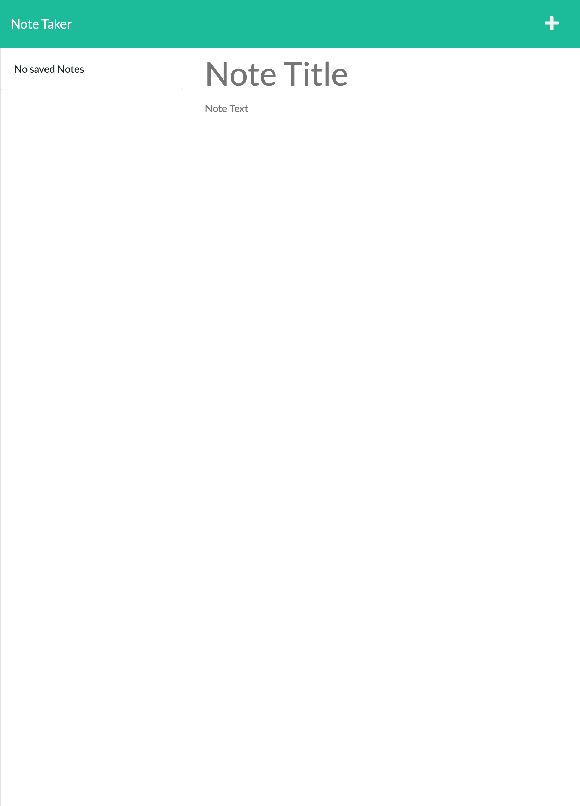

# Note Taker

## Description

This application is used for taking down notes. The notes include a title and a body of text. There can be multiple notes created and saved to the application using the save button. Users can access old saved notes. Users are also able to delete saved notes with the trash button.

Made with:

- HTML
- CSS
- JS
- Express.js
- node modules

## Table of Contents

- [Installation](#installation)
- [Usage](#usage)
- [License](#license)
- [Questions](#questions)

## Installation

Use the deployed service, or clone this repo to use an individual local sever.

## Usage

## License

## Questions

Github: EricaBabb
Email: ecamilebabb@gmail.com
